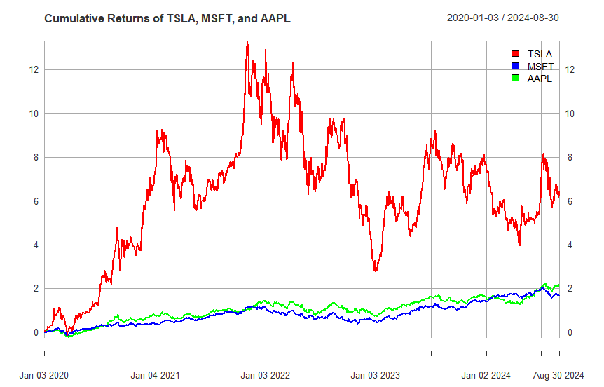
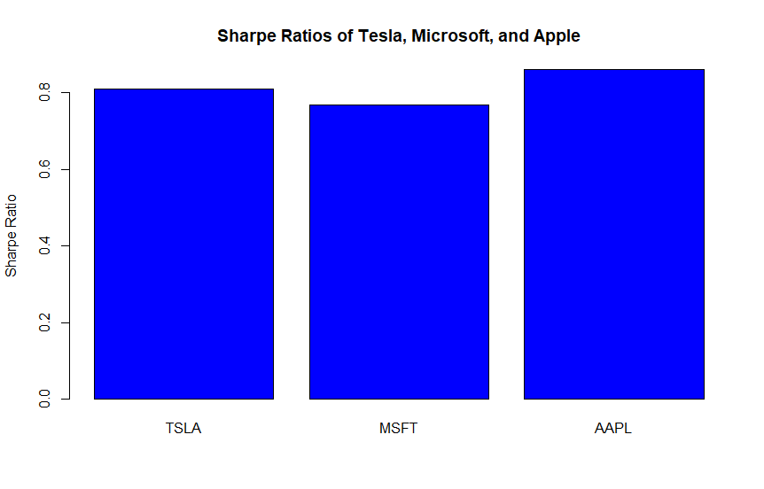

# Stock Returns Analysis and Risk Metrics with R

This project provides a comprehensive analysis of the daily and cumulative returns of three major stocks—Tesla (TSLA), Microsoft (MSFT), and Apple (AAPL)—using R. It also computes and visualizes key risk metrics such as the Sharpe Ratio and Maximum Drawdown to offer insights into the risk-adjusted performance of these stocks.

## Table of Contents
- [Overview](#overview)
- [Features](#features)
- [Visualization](#visualization)
- [Results](#results)

## Overview

In this project, we:
1. **Analyze Daily and Cumulative Returns**: Fetch historical stock data for TSLA, MSFT, and AAPL from Yahoo Finance and calculate their daily and cumulative returns.
2. **Calculate Risk Metrics**: Compute the Sharpe Ratio and Maximum Drawdown to assess the risk-adjusted returns and potential losses.
3. **Visualize the Data**: Create visualizations for daily returns, cumulative returns, Sharpe Ratios, and Maximum Drawdowns to provide insights into the stocks' performance.

This project is ideal for anyone looking to understand basic financial data analysis and visualization in R, particularly those interested in the quantitative finance field.

## Features

- Fetch historical stock data using `quantmod`.
- Calculate daily and cumulative returns.
- Compute risk metrics such as Sharpe Ratio and Maximum Drawdown using `PerformanceAnalytics`.
- Visualize data using `ggplot2` for enhanced insights.

## Visualization

The project includes several visualizations to help understand the performance and risk profile of Tesla (TSLA), Microsoft (MSFT), and Apple (AAPL) stocks:

1. **Daily Returns Plot**:  
   A time series plot showing the daily returns of TSLA, MSFT, and AAPL. This plot allows you to visualize the daily volatility and the fluctuations in stock prices over time.  
   

2. **Cumulative Returns Plot**:  
   A time series plot that displays the cumulative returns of each stock, which is the compounded return achieved over time. This helps in visualizing the overall growth or decline of an investment in each stock.  
   

3. **Sharpe Ratio Barplot**:  
   A bar plot that illustrates the Sharpe Ratio of each stock. The Sharpe Ratio measures the risk-adjusted return, providing an indication of how much return is achieved per unit of risk. A higher Sharpe Ratio suggests better risk-adjusted performance.  
   

4. **Maximum Drawdown Barplot**:  
   A bar plot showing the Maximum Drawdown for each stock, which represents the maximum observed loss from a peak to a trough of a portfolio before a new peak is achieved. This metric is crucial for understanding the potential risk of significant losses.  
   

These visualizations provide valuable insights into both the returns and risks associated with investing in these popular tech stocks.

## Results

The analysis reveals the following key insights into the performance and risk profile of TSLA, MSFT, and AAPL:

- **Daily Returns Analysis**:  
  The daily returns plot highlights the day-to-day volatility of each stock. Tesla (TSLA) shows higher volatility compared to Microsoft (MSFT) and Apple (AAPL), indicating more frequent and larger swings in daily returns.

- **Cumulative Returns Analysis**:  
  The cumulative returns plot shows how each stock has grown over time. Tesla, despite its higher volatility, has shown a significant upward trajectory, suggesting higher returns for investors willing to tolerate more risk.

- **Sharpe Ratio**:  
  The Sharpe Ratio barplot indicates that Microsoft (MSFT) has a relatively balanced risk-adjusted return compared to Tesla and Apple. A higher Sharpe Ratio means better compensation for the risk taken.

- **Maximum Drawdown**:  
  The Maximum Drawdown barplot reveals that Tesla has the highest potential for significant losses from its peak, while Microsoft has a lower maximum drawdown, suggesting it is a more stable investment during downturns.

These results help investors make informed decisions by providing a deeper understanding of both the returns and risks associated with these stocks. Understanding these metrics is crucial for portfolio optimization and risk management.

